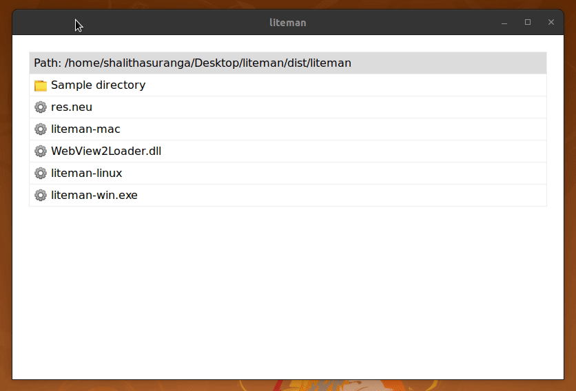
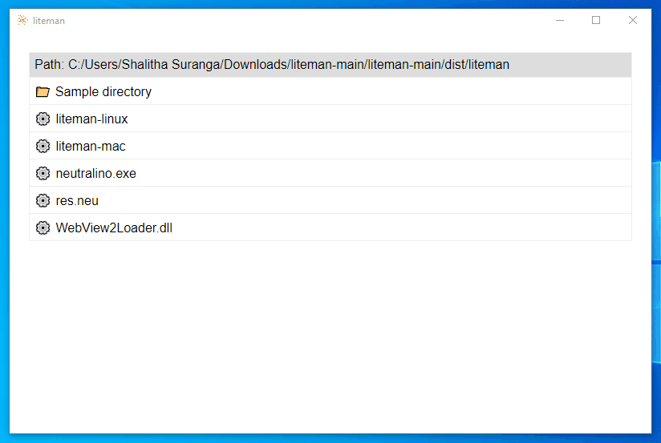
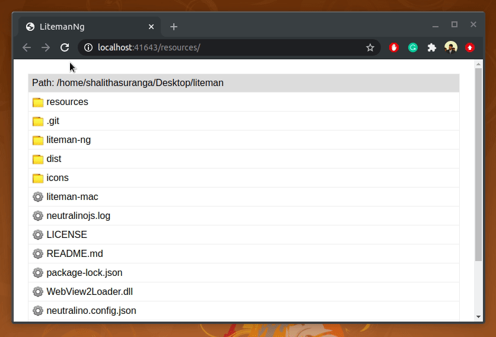

# liteman
A simple file manager app written in Neutralinojs

## on Linux


## on Windows


## on macOS
[Support](https://github.com/neutralinojs/v2-specification) Neutralinojs to release the v2 version for macOS.

## on Browser


# Developer Q & A

How to run the app?

```
 $ neu run
```

How to make a development build of Angular code (to test my changes)?

```
 $ cd liteman-ng
 $ npm run build
```

How to make a production build of Angular code (to make a new release)?

```
 $ npm run build_prod
```

How to make binaries for the latest code?

```
 $ neu build
```

## License

[MIT](LICENSE)
Copyright (c) Shalitha Suranga
